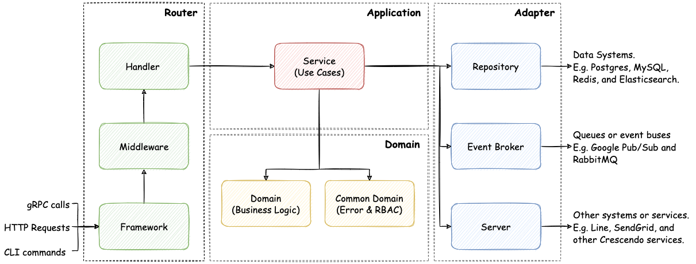
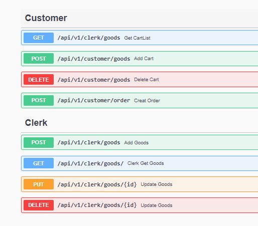

# Simple store

**Simple store**是基於*Crescendo Lab* go-clean-arch 模板實現基本的網頁商店後端功能

## Table of Content:

- [About The project](#about-the-project)
- [Technologies](#technologies)
- [Architecture](#screenshots)
- [Setup](#setup)
- [Approach](#approach)
- [Status](#status)
- [License](#license)

## About The project

這個 Side project 我是用來學習跟實現的小專案，後端架構參考 Crescendo Lab 的 DDD(Domain-Driven Design)實現，裡面使用到 Postgres 資料庫來存儲商品目錄以及顧客訂單，和使用 Redis 實現簡易的購物車，以及 OAuth 跟 JWT 確認身份以及驗證，來管理商品以及更新訂單

## Technologies

<details><summary>後端</summary>

- [Golang](https://go.dev): ^1.17
- [gin](https://github.com/gin-gonic/gin): ~1.7.7
- [viper](https://github.com/spf13/viper): ~1.15.0
- [cobra](https://github.com/spf13/cobra): ~1.6.1
- [oauth](https://github.com/golang/oauth2): ~7.0

</details>

<details><summary>日誌文件</summary>

- [swagger](https://github.com/swaggo/swag): ~1.8.1
- [zerolog](https://github.com/rs/zerolog): ~1.26.1

</details>

<details><summary>資料庫</summary>

- [postgres](https://github.com/swaggo/swag):
- [redis](https://github.com/rs/zerolog):
- [sqlc](https://github.com/rs/zerolog):
- [migrations](https://github.com/rs/zerolog):

</details>

<details><summary>測試</summary>

- [testify](https://github.com/stretchr/testify): ^1.8.0
- [mockgen](https://github.com/golang/mock): ~1.6.0
- [testfixtures](https://github.com/go-testfixtures/testfixtures): ^3.8.0
- [migrate](https://github.com/golang-migrate/migrate): ^4.15.0
- [dockertest](https://github.com/ory/dockertest): ^3.9.0

</details>


## Setup

- 啟動資料庫 : 啟動 postgres 跟 redis
  ```sh
  docker-compose up
  ```
- 建立資料庫表格
  ```sh
  make migrateup
  ```
- 運行後端
  ```sh
  go run main.go
  ```
- API SWAGGER 文件
  ```sh
   http://localhost:8080/swagger/index.html
  ```
## Architecture

這個後端架構分為四層 參考來源: [go-clean-arch](https://github.com/chatbotgang/go-clean-arch/tree/7a7462370b5c2a43817147f6e92db3b62ae6989a)
- `Router` 處理輸入請求的事情，例如 HTTP 請求路由、身份驗證、訪問控制和參數驗證。
- `Adapter` 處理輸出請求，例如訪問數據庫、與外部服務通信、將事件發送到隊列。
- `Application` 處理跟調用Domain層跟Adapter層。
- `Domain` 處理業務和產品相關的核心邏輯。

實現:
- `Router`層 : 放入Oauth middleware，是因為訂單跟購物車根據客戶ID操作，會經過google認證服務取得客戶資訊
- `Adapter`層 : 放入Postgres和 Redis調用資料庫，Postgres用於存放需永久保存資料例如訂單跟商品，而Redis存放購物車商品
- `Application`層 : 根據業務而有不同的Service，例如根據業務分成了Clerk跟Customer Service，會調用不同的`Domain`跟`Adapter`處理流層
- `Domain`層 : 主要用來處理業務邏輯，裡面只會接收`Application`層輸入資料，處理完後返回給`Application`層
    
## Approach
- 資料庫方面
  - 會使用migrations來創建跟版控資料庫的表格
  - 不使用gorm操作資料庫，使用sqlc自動產生Sql語法，統一對於DB代碼風格，且對於DB操作效能上有一定提升。
- API文件
  - 在 router 內寫 swagger 的註解讓自動產生 api 的相關資訊，以及在使用 zerolog 日誌庫，搜集 API 相關訊息
  - 使用 gin 框架來開發後端，以及使用 viper 跟 cobra 自動產生 CMD 與抓取 config，在 middleware 裡添加 google 的 ouath 認證
  - 使用github action來自動化測試每次的Pull Request
- 單元測試
  - 測試包含Adapter、Application、Domain
  - 使用mockgen產生假的Adapter跟Domain，去測試Application，減少測試時的依賴
  - Adapter測試需要實際的postgres跟redis，會用dockertest，去實例化一個資料庫，測試完在自動刪除


